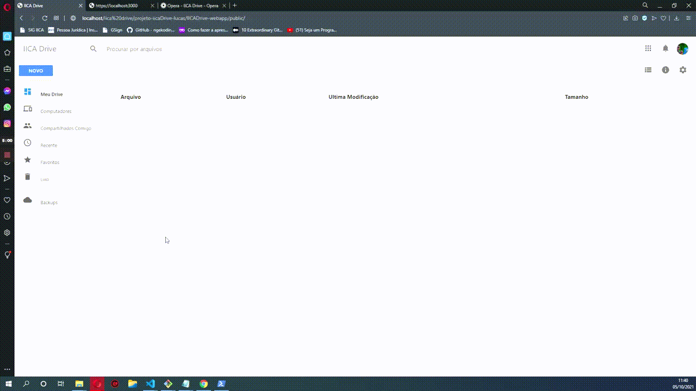

## Preview



## About this project

This is the first API version of the MAPA/IICA/BID project - Virtual Hubs.

In its initial version it has support for uploading files and organizing them!

## What's the point

Meet the demand of the project using our own virtual hub so that ***using this same project it is possible to have ease in using artificial intelligence to cross data.***

## first steps

If you are interested in seeing how it works in practice, download this project and the other repository called IICADrive-WebApp which is also found in my public repository.

```
$ git clone https://github.com/LucasMSCaetano/IICADrive-WebApi.git

$ cd IICADrive-WebApi

$ npm i

$ npm start 
```
